# Постановка задачи Intelligent Placer
Требуется создать “Intelligent Placer”: по поданной на вход фотографии нескольких предметов на светлой горизонтальной поверхности и многоугольнику понимать, можно ли расположить одновременно все эти предметы на плоскости так, чтобы они влезли в этот многоугольник. Предметы и горизонтальная поверхность, которые могут оказаться на фотографии, заранее известны. Также заранее известно направление вертикальной оси Z у этих предметов. Многоугольник задается массивом с координатами вершин на естественной плоскости.

## Оформление проекта
 “Intelligent Placer” должен быть оформлен в виде python-библиотеки intelligent_placer_lib, которая поставляется каталогом intelligent_placer_lib с файлом intelligent_placer.py, содержащим функцию - точку входа 
 
def check_image (<path_to_png_jpg_image_on_local_computer>[, <poligon_coordinates>])

Возвращает True если предметы могут влезть в многоугольник, иначе False.

## Требования к изображеиям:

1) Объекты на изображении должны быть хорошо различимы(выделяться на фоне белого листа).
2) В качестве фоновой светлой поверхности должен выступать белый лист бумаги.
3) Предметы не пересекаются с краем фонового листа.
4) Углы и края белого листа и объекта попадают на фото целиком не перекрываясь.
5) Камера должна смотреть на объект вертикально или под небольшим углом.
6) Изображения не должны быть сильно зашумлены.

## Многоугольник
* Многоугольник задается массивом координат вершин на естественной плоскости.
* В качестве единицы в системе коорднат выступают миллиметры. 
* Многоугольник должен являться замкнутой фигурой.
* Массив координат должен быть упорядочен(каждая предыдущая вершина будет соединяться со следующей).

# Обнаружение объектов на изображении
Для обнаружения объектов на изоражении исользуется библиотека rembg - библиотека, используемая для удаления фона. Использовалась стандартная модель этой библиотеки.

Изначальное изображение

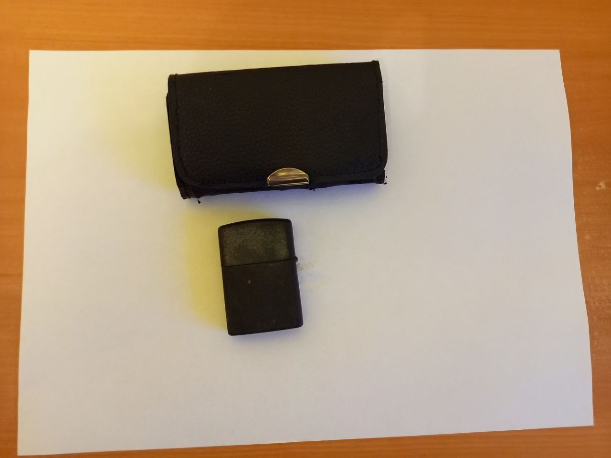

Изображение после применения удаления фона и выделением контуров.

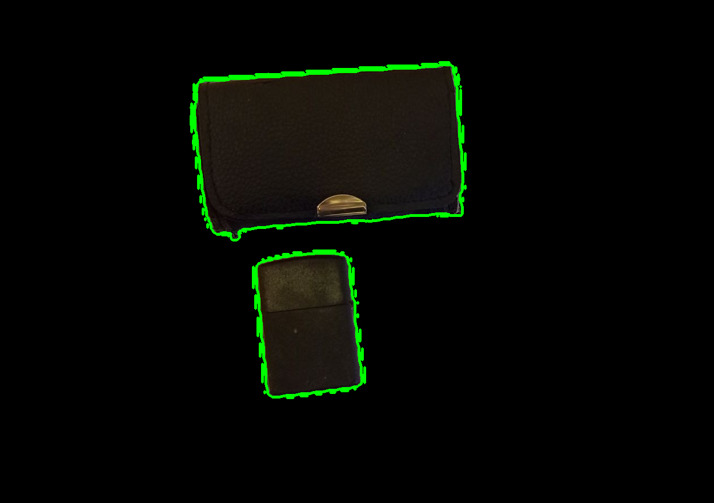

# Вычисление истинных параметров объектов
Для вычисления истинных размеров объектов использовался следующий алгоритм:

1) Обнаружение белого листа на изображении
2) Вычисление площади белого листа в пикселях, вычисление площади белого листа в миллиметрах
3) Нахождение коэффициента из отношения площадей
4) Исопльзование коэффициента для нахождения истинных параметров объектов

Изначальное изображение

Изображение после нахождения белого листа

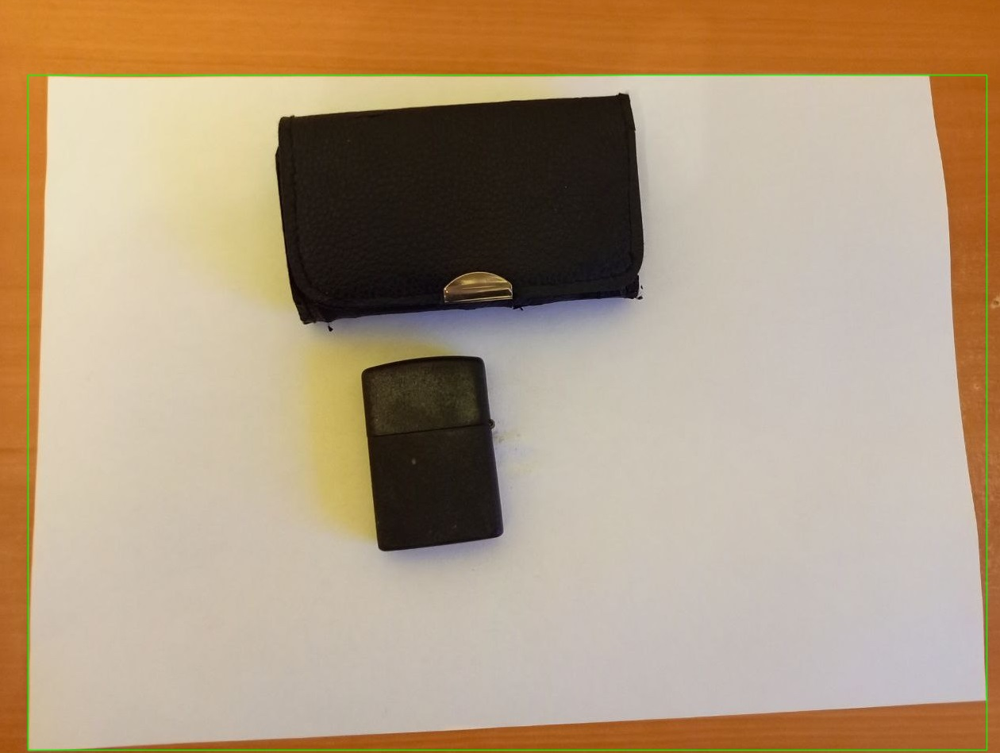

Для выделение белого листа на изображении использовалась следующая маска: 

thresh_otsu = threshold_otsu(img_gray)

otsu = img_gray >= thresh_otsu

После вычисления истинных границ объектов удаляются те объекты, площадь которых меньше 50 мм^2

# Размещение объектов в многоугольнике
Для нахождения позиций объектов в многоугольнике использовался следующий алгоритм:

0) Если общая площадь многоугольника меньше общей площади объектов, их невозможно расположить

* Каждый объект размещается в многоугольнике максимизируя расстояние - соприкосновения сторон объекта с многоугольником. (максимизируетс яплощади пересечения многоугольника и объекта + расстояние между центрами)
* Если результирующий объект полностью не лежит в области многоугольника, то возвращается False - проверка площади.(Существует погрешность вычисления площади, поэтому берется интервал в 5%)

Пример с большой областью
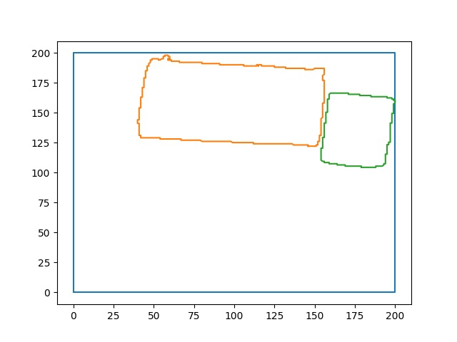

Пример с малой областью, не смог разместить 1-й объект
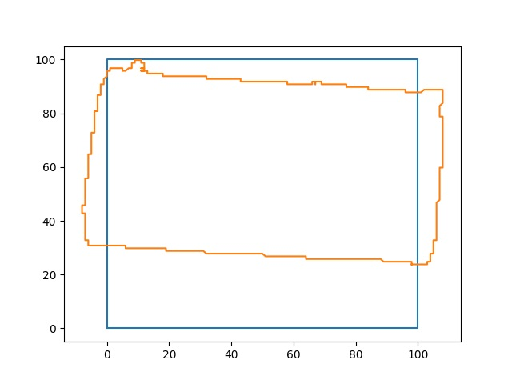

Пример с малой областью, не смог разместить 2-й объект
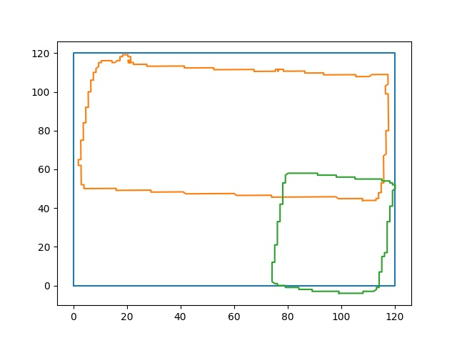

Пример с средней областью, объекты успешно размещены
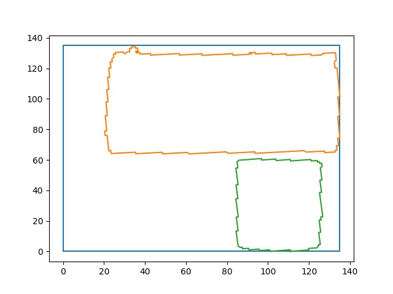

# Работа программы на примерах
Polygon([[0, 0], [80, 0], [80, 80], [0, 80]])

## Пример 2
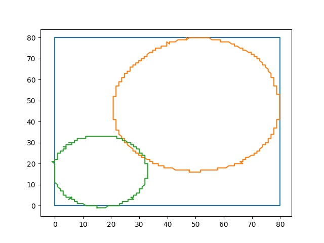

## Пример 3
В данном примере некорректно обрабатывается отделение фона, из за чего вместо 2-х объектов получается 1

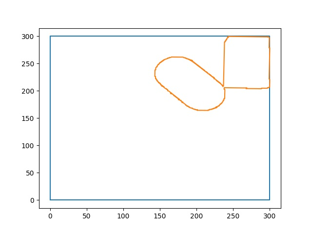

## Пример 4
Polygon([[0, 0], [70, 0], [70, 70], [0, 70]])

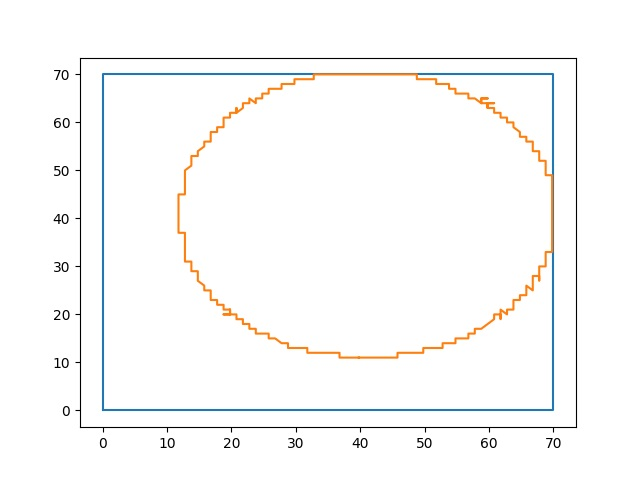

## Пример 7
Polygon([[0, 0], [100, 0], [100, 100], [0, 100]])

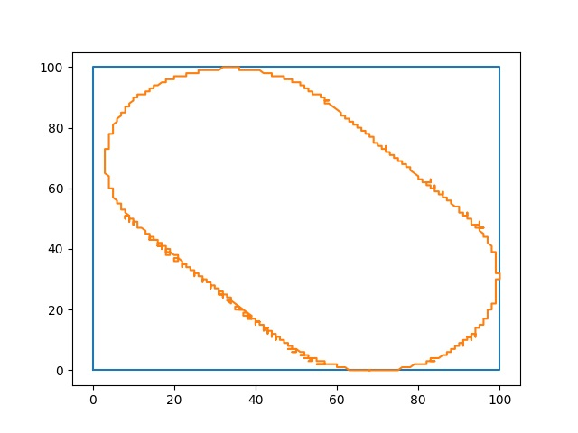

Polygon([[0, 0], [100, 0], [100, 80], [0, 80]])

True

Пример некоректной работы из за проблем при сравнении площадей
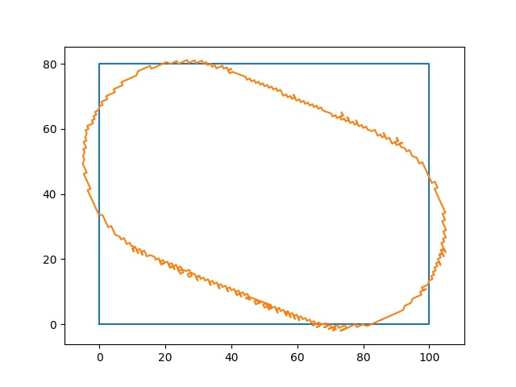

## Больше примеров

### 1
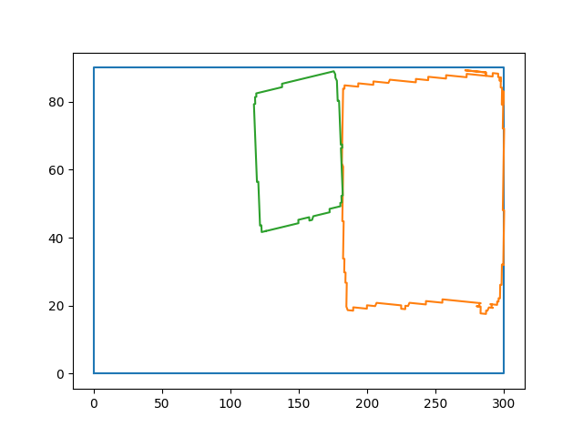

### battarey
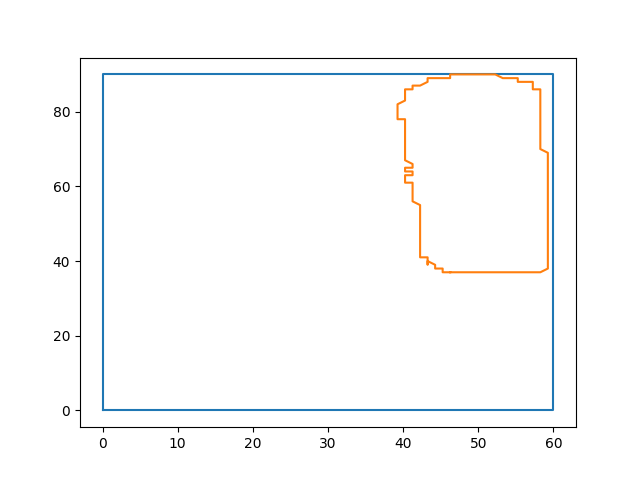

### clock
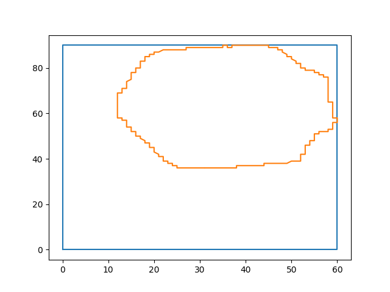

### usb
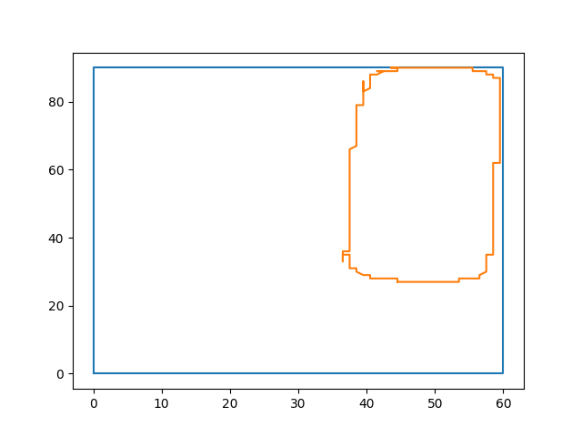

# Идеи по улучшению алгоритма

* Добавление границ окрагуления в параметры метода и создания значения по умолчанию
* Создание пула наиболее подходящих методов оптимизации
* Сужение нейронной сети